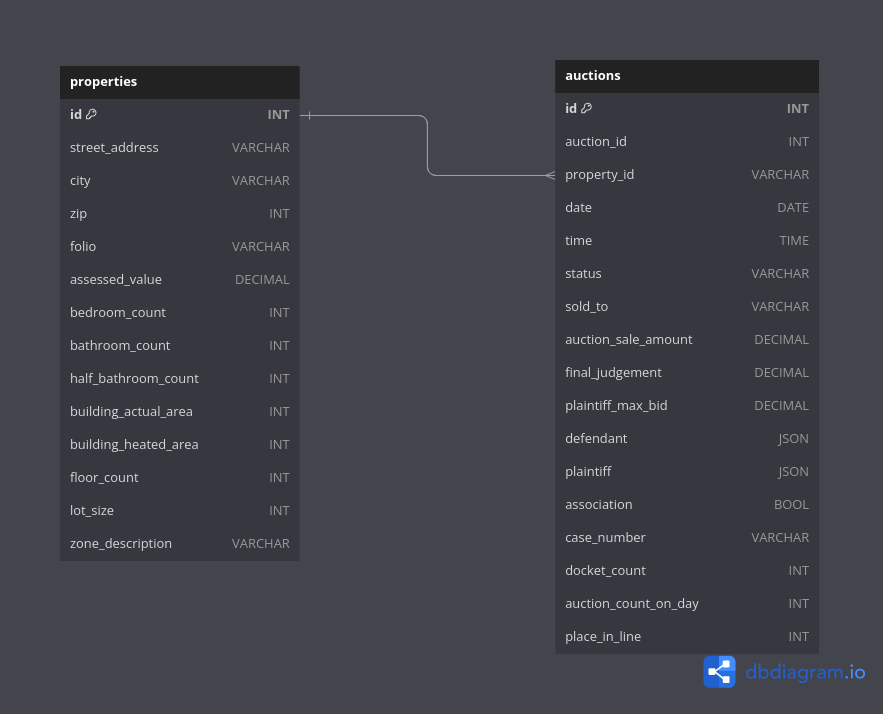
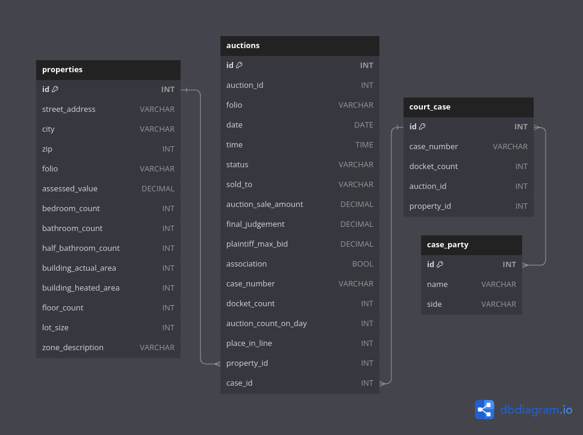

<p align="center">
    <i align="center">A project that scrapes and models data from Miami-Dade foreclosure pipeline to give investors some forward guidance</i>
</p>
<h4 align="center">
    
</h4>

## Purpose
This repo is a portfolio piece and a refactor of my original codebase. The original code is currently visible in the deprecated folder. 

This project was originally designed to create a filter on upcoming foreclosure auctions. When I first started writing this code back in 2015 there were often days that had over 100 foreclosure auctions. Buying a property at foreclosure requires a significant amount of due diligence and it was simply not possible to adequately research all of the auctions. 

Foreclosure suite uses modeling to filter out auctions that are not likely worth researching. The models assess three criteria to determine if a property is worth researching.

<ol>
    <li>How likely is it that the auction will be canceled prior to the sale date</li>
    <li>How likely is it that the Plaintiff will make the winning bid</li>
    <li>Given the property is sold to a 3rd party, how much will it sell for</li>
</ol>

The user can generate a list of properties that are likely to actually go to auction and sell to a 3rd party for a desirable price. We will also be able to determine if there is a home owners association seeking damages.


## Setup
The user must have login credentials for <a href="http://realforeclose.miamidade.gov">Miami-Dade foreclosure</a> as well as <a href="https://www2.miamidadeclerk.gov/PremierServices/login.aspx">Miami-Dade Clerks Office</a>. These credentials are saved in a .env

There will be some sort of setup process for the database as well.

Ideally, there will be a setup.py eventually

## Modules
### Scrapers
There are three sources of data and accordingly 3 scrapers. There is a submodule to handle dynamic URL's and payloads for the GET and POST requests. These modules are imported by the scraper and abstracted from the user.

<details>
<summary>Foreclosure</summary>
<br>
This is the scraper module responsible for pulling data from the
<a href='https://www.miamidade.realforeclose.com/'>Miami-Dade foreclosure</a> website. We get access to information about auctions, and some partial data regarding court records and property information from 3 different endpoints

<br>
Foreclosure scraping begins by getting a list of auction id's for a given date.

```python
>>> from foreclosure_suite.scrapers.foreclosure import ForeclosureScraper

>>> foreclosure_scraper = ForeclosureScraper()
>>> auction_id_list = foreclosure_scraper.get_days_aids(auction_date)
>>> auction_id_list
['1253580', '1254736', ..., '1250248', '1255395']
```
The auction id then allows us access to two new endpoints

The first of which returns data about the auction results:
```python
>>> foreclosure_scraper.get_auction_sale_data(auction_id_list[0])
{
    'status': 'Canceled per Order', 
    'time': '', 
    'sale': '', 
    'plaintiff_max_bid': 'A'
}

>>> foreclosure_scraper.get_auction_sale_data(auction_id_list[1])
{
    'status': '3rd Party Bidder', 
    'time': '08/09/2023 09:03 AM ET', 
    'sale': '$321,100.00', 
    'plaintiff_max_bid': '$300,000.00'
}

>>> foreclosure_scraper.get_auction_sale_data(auction_id_list[3])
{
    'status': 'Sold to Plaintiff', 
    'time': '08/09/2023 09:07 AM ET', 
    'sale': '$422,300.00', 
    'plaintiff_max_bid': '$500,000.00'
}
```
The second gives us some data about the legal case and the property itself
```python
>>> foreclosure_scraper.get_auction_property_data(auction_id_list[2])
{
    'case_number_(count)': '2019-007340-CA-01', 
    'count_description': '', 
    'case_type': 'FORECLOSURE', 
    'final_judgment_amount': '$409,803.13', 
    'parcel_id': '30-3122-008-2020', 
    'certificate_number': '', 
    'property_address': '4041 NW 23 CT', 
    'assessed_value': '$115,890.00', 'property_appraiser_legal_description': ' 22 53 41\nGARDEN CITY PB 5-73\nW1/2 OF LOTS 29 & 30 BLK 9\nLOT SIZE 100.860 X 69\nOR 18802-0649 0999 1\nCOC 24567-1736 05 2006 1', 
    'defendant': ['LINARTE, JAIRO J', 'VEGA, LUCILA G', 'MIAMI-DADE C   UCILA', 'Sherman, David Alan'], 
    'plaintiff': ['BANK OF NEW YORK MELLON (THE)', 'Dreilinger, Gregg R']
}

```
</details>
<details>
<summary>Appraisers Office</summary>
<br>
This scraper is responsible for scraping data from the county appraisers office through the county's <a href='https://www.miamidade.gov/Apps/PA/propertysearch/#/'>property search. </a>
The ```foreclosure_scraper.get_auction_property_data``` response gives us a property parcel_id which we can then use to scrape data from the county appraisers office. This endpoint exposes a significant amount of data about the property itself

```python
from foreclosure_suite.scrapers.appraiser import AppraiserScraper

>>> appraiser_scraper = AppraiserScraper(parcel_id)
>>> property_data = appraiser_scraper.get_appraisers_json()

>>> property_data['Assessment'][0]
{
    'AssessedValue': 127479, 
    'BuildingOnlyValue': 125976, 
    'ExtraFeatureValue': 1608, 
    'LandValue': 205290, 
    'Message': None, 
    'TotalValue': 332874, 
    'Year': 2023
}

>>> property_data['Building']['BuildingInfos'][0]['HeatedArea']
1453

>>> property_data['ExtraFeature']['ExtraFeatureInfos'][0]['Description']
'Chain-link Fence 4-5 ft high'

>>> property_data['PropertyInfo']['BathroomCount']
3

>>> property_data.keys()
dict_keys(['Additionals', 'Assessment', 'Benefit', 'Building', 'ClassifiedAgInfo', 'Completed', 'District', 'ExtraFeature', 'GeoParcel', 'Land', 'LegalDescription', 'MailingAddress', 'Message', 'OwnerInfos', 'PropertyInfo', 'RollY
ear1', 'SalesInfos', 'SiteAddress', 'Taxable'])

```
</details>

<details>
<summary>Court Records</summary>
<br>
The ```foreclosure_scraper.get_auction_property_data``` response gives us a case number which we can then use to scrape data from the clerk of courts. The clerk of courts website uses aspx.net and is very slow to scrape. The only datapoint we currently extract is number of items on the docket


```python
from foreclosure_suite.scrapers.courts import CourtScraper

>>> court_scraper = CourtScraper(case_number)
>>> court_scraper.get_docket_count()
212
```
It would be beneficial to eventually scrape each docket entry and search for evidence of upcoming cancellation.
</details>

## Data

Here is a working schema of the database tables. Created using [dbdiagram](https://dbdiagram.io)
<h4 align="center">
    Simple
    
    <br>
    <br>
    Alternative
    
</h4>

## Structure
The following structure is tentative and will be updated often

```bash
web_scraper/
├── __init__.py
├── scraper/
│   ├── __init__.py
│   ├── urls/
│   │   ├── __init__.py
│   │   ├── foreclosure_urls.py
│   │   ├── appraiser_urls.py
│   │   └── court_urls.py
│   ├── payloads/
│   │   ├── __init__.py
│   │   ├── foreclosure_payloads.py
│   │   ├── appraiser_payloads.py
│   │   └── court_payloads.py
│   ├── foreclosure.py
│   ├── appraiser.py
│   ├── court.py   
│   ├── master.py 
│   └── utils.py 
├── database/
│   ├── __init__.py
│   └── database_handler.py
├── data_processing/
│   ├── __init__.py
│   └── data_processor.py
├── modeling/
│   ├── __init__.py
│   └── model_builder.py
├── utils
│   ├── __init__.py
│   └── common_utils.py
├── cli/
│   ├── __init__.py
│   ├── commands.py
│   └── main.py
└── main.py
```
